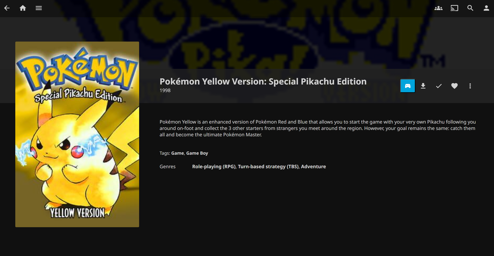
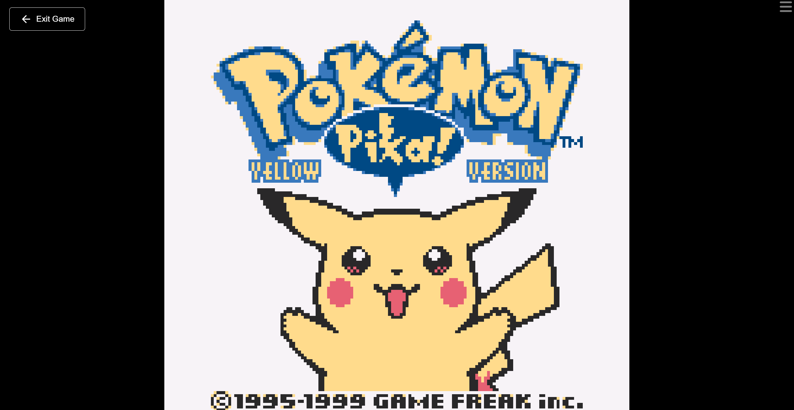
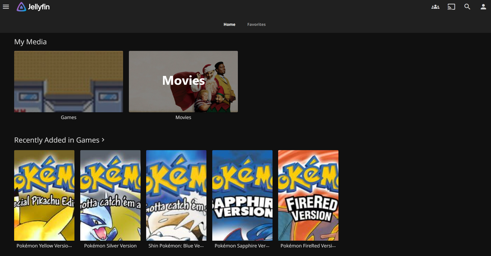
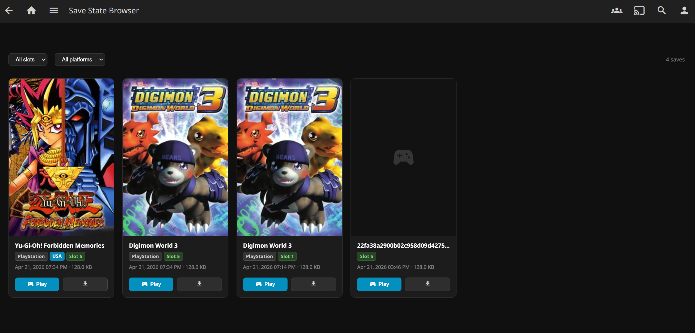

<div align="center">
  
  <h1>JellyEmu</h1>
  <p>A plugin for jellyfin 10.11+ to import, play and share your roms with users.</p>
</div>

---

## Screenshots

<p align="center">
  <a href="assets/screen01.png">
    
  </a>
   
  <a href="assets/screen02.png">
    
  </a>

  <a href="assets/screen03.png">
    
  </a>

  <a href="assets/screen04.png">
    
  </a>
</p>
<p align="center">
  <em>Click on an image to view it full size.</em>
</p>

---

# JellyEmu Plugin Setup Guide

This guide details the process for integrating an emulation collection into Jellyfin for metadata management and direct playback.

<p align="center">

[](https://github.com/Jellyfin-PG/JellyEmu/actions)

[](https://github.com/Jellyfin-PG/JellyEmu/releases)

[](https://github.com/orgs/Jellyfin-PG/projects/2)

[](https://discord.gg/v7P9CAvCKZ)

</p>

---

## 1. Plugin Configuration
Before adding your media, you must configure the plugin to communicate with external game databases.

* Navigate to **Dashboard** and select **Plugins**.
* Locate and select the **Emulator Library** configuration page.
* Input your **IGDB API Key** (Client ID and Client Secret).
* Input your **RAWG API Key**.
* Save your changes. This ensures the metadata providers are authenticated and ready to fetch game data.

---

## 2. Library Creation
With the plugin configured, you can now create the library to house your ROMs.

* Go to **Dashboard** and select **Libraries**.
* Click **Add Media Library**.
* Select **Books** as the Content Type. Note: This specific type is required for the plugin to map game data correctly within the Jellyfin database.
* Assign a name such as **Video Games** and add the folder path where your ROMs are stored.
* Under the **Metadata Downloaders** section, ensure that **IGDB** and **RAWG** are checked/enabled.
* Finalize the library creation by clicking **OK**.

---

## 3. Supported Platforms and Extensions
Ensure your files are placed in the library folder using the supported extensions for each platform.

| Platform | Common Extensions |
| :--- | :--- |
| **Nintendo (NES)** | .nes |
| **Super Nintendo (SNES)** | .sfc, .smc |
| **Game Boy (GB)** | .gb |
| **Game Boy Color (GBC)** | .gbc |
| **Game Boy Advance (GBA)** | .gba |
| **Virtual Boy (VB)** | .vb |
| **Nintendo DS (NDS)** | .nds |
| **Nintendo 64 (N64)** | .n64, .z64 |
| **PlayStation (PSX)** | .iso, .bin, .cue, .chd |
| **PlayStation Portable (PSP)** | .iso, .cso |
| **Sega Genesis / Mega Drive** | .md, .gen, .bin |
| **Sega CD** | .iso, .bin, .cue, .chd |
| **Sega Game Gear** | .gg |
| **Sega Saturn** | .iso, .bin, .cue |
| **Sega 32X** | .32x |
| **Sega Master System** | .sms |
| **Atari 2600** | .a26, .bin |
| **Atari 5200** | .a52, .bin |
| **Atari 7800** | .a78, .bin |
| **Atari Jaguar** | .j64, .jag |
| **Atari Lynx** | .lnx |
| **MAME / Arcade / CPS** | .zip, .7z |
| **3DO** | .iso, .bin, .cue |
| **Commodore 64** | .d64, .g64, .t64 |
| **Commodore 128** | .d64, .d81 |
| **Commodore PET** | .d64, .t64 |
| **Commodore Plus/4** | .d64 |
| **Commodore VIC-20** | .d64 |
| **Amiga** | .adf, .ipf, .lha |
| **ColecoVision** | .col, .rom |
| **PC Engine / TurboGrafx-16** | .pce, .bin, .cue |
| **PC-FX** | .bin, .cue |
| **Neo Geo Pocket** | .ngp, .ngc |
| **WonderSwan** | .ws, .wsc |
| **DOS** | .exe, .com, .conf, .zip |

---

## 4. Scanning and Playback
Once the library is established and the providers are enabled:

* Go to **Dashboard** and select **Libraries**.
* Click the three dots on your game library and select **Scan Library Files**.
* Jellyfin will begin matching your files against IGDB and RAWG to download box art and descriptions.
* Once the scan finishes, your games will appear on the home screen, ready to be browsed and played.

---

## Installation

JellyEmu depends on the **File Transformation** plugin to inject CSS and JavaScript into Jellyfin's web interface. Both plugins must be installed from the same plugin catalogue — install them in the order below.

### Step 1 — Add the plugin catalogue

1. Open your Jellyfin dashboard
2. Go to **Administration → Plugins → Repositories**
3. Click **Add** and enter the following URL:

```
https://raw.githubusercontent.com/Jellyfin-PG/Repository/refs/heads/main/manifest.json
```

4. Click **Save**

### Step 2 — Install File Transformation

1. Go to **Administration → Plugins → Catalogue**
2. Find **File Transformation** and click **Install**
3. When prompted, confirm the installation

### Step 3 — Install JellyEmu

1. Still in the **Catalogue**, find **JellyEmu** and click **Install**
2. When prompted, confirm the installation

### Step 4 — Restart Jellyfin

Restart your Jellyfin server. Both plugins must be active at the same time — File Transformation handles the page injection, JellyEmu manages your roms.

---

## ROM Naming & Folder Structure Guide

JellyEmu uses a smart detection system to figure out which console a ROM belongs to and exactly which game it is. You have a lot of flexibility in how you organize your library.

### How Platform Detection Works
The plugin determines a ROM's platform using a strict 3-step priority list. If step 1 fails, it moves to step 2, and so on.

1. **Inline Tokens:** The system looks for a platform name wrapped in brackets `[]` or parentheses `()` anywhere in the filename.
2. **Folder Names:** The system checks the parent and grandparent folder names of the ROM file.
3. **File Extensions:** The system checks the file extension. This only works for **unambiguous** extensions (like `.nes` or `.z64`).

> **Note on Ambiguous Formats:** Formats shared across multiple consoles (like `.iso`, `.chd`, `.cue`, and `.pbp`) are considered ambiguous. For these files, you **must** use an inline token or place them in a properly named folder, otherwise the platform will be marked as "Unknown".

---

| Target Platform | Accepted Folder Names & Inline Tokens |
| :--- | :--- |
| **Nintendo Entertainment System (NES)** | `nes`, `famicom`, `nintendo entertainment system` |
| **Super Nintendo (SNES)** | `snes`, `super nintendo`, `super famicom`, `super nintendo entertainment system` |
| **Nintendo 64** | `n64`, `nintendo 64` |
| **Game Boy / Color** | `gb`, `game boy`, `gameboy`, `gbc`, `game boy color`, `gameboy color` |
| **Game Boy Advance** | `gba`, `game boy advance`, `gameboy advance` |
| **Nintendo DS** | `nds`, `nintendo ds`, `ds` |
| **Virtual Boy** | `vb`, `virtual boy` |
| **Sega Master System** | `sms`, `master system`, `sega master system` |
| **Sega Genesis / Mega Drive** | `genesis`, `sega genesis`, `mega drive`, `sega mega drive`, `md` |
| **Sega Game Gear** | `gg`, `game gear`, `sega game gear` |
| **Sega CD** | `sega cd`, `segacd`, `mega cd`, `sega-cd` |
| **Sega 32X** | `32x`, `sega 32x` |
| **PlayStation 1** | `psx`, `ps1`, `playstation`, `playstation 1`, `ps one` |
| **Atari 2600** | `atari 2600`, `2600` |
| **Atari 7800** | `atari 7800`, `7800` |
| **Atari Lynx** | `lynx`, `atari lynx` |
| **Atari Jaguar** | `jaguar`, `atari jaguar` |
| **WonderSwan** | `ws`, `wonderswan`, `wonder swan` |
| **TurboGrafx-16 / PC Engine** | `pce`, `turbografx`, `turbografx-16`, `turbografx 16`, `pc engine` |
| **ColecoVision** | `coleco`, `colecovision` |
| **NeoGeo Pocket / Color** | `ngp`, `neogeo pocket`, `neo geo pocket`, `ngpc` |

---

### Method 1: Organizing by Folder (Recommended)
The easiest way to organize a large library is to place your ROMs inside folders named after the console. JellyEmu checks up to two directories up, so subfolders for game series are perfectly fine.

The folder name can be the official name or a common abbreviation (e.g., `SNES`, `Super Nintendo`, and `Super Famicom` will all map to **SNES**).

**Examples:**
```text
/ROMs/
 ├── /SNES/
 │    └── Super Mario World.sfc          (Platform: SNES)
 ├── /PlayStation/
 │    ├── /Final Fantasy VII/
 │    │    └── Disc 1.chd                (Platform: PlayStation)
 └── /Sega Genesis/
      └── Sonic The Hedgehog.md          (Platform: Sega Genesis)
```

### Method 2: Inline Naming Tokens
If you prefer to dump all your ROMs into a single flat directory, you can explicitly define the platform by adding the console name in brackets `[]` or parentheses `()` in the filename.

JellyEmu will automatically hide these platform tags in the user interface so your game titles remain clean.

**Examples:**
* `Sonic CD [Sega CD].chd` ➔ UI Display: **Sonic CD**
* `Crash Bandicoot (PS1).chd` ➔ UI Display: **Crash Bandicoot**
* `Super Mario 64 [Nintendo 64].z64` ➔ UI Display: **Super Mario 64**

*region flags are now parsed (like `(USA)`) and added to game details.*

*revision flags (like `[!]`) are intentionally ignored by the platform detector and will remain part of the display name.*

---

### Forcing Specific Metadata (IGDB & RAWG)
Sometimes, game titles are ambiguous, or a metadata provider grabs the wrong version of a game (like an HD remake instead of the retro original). 

You can force JellyEmu to link the ROM to a specific database entry by adding a provider ID directly into the filename. The plugin will use this exact ID to fetch artwork and descriptions, and will automatically hide the token from the UI.

* **For IGDB:** Use `[igdb-ID]` 
* **For RAWG:** Use `[rawg-SLUG]`

**Examples:**
* `Doom [igdb-1039].iso` ➔ Forces the IGDB entry for the 1993 original, rather than the 2016 reboot.
* `Aladdin (Sega) [rawg-disneys-aladdin-1993].md` ➔ Forces the exact RAWG entry.

You can combine provider IDs and platform tokens safely. For example:
`Sonic Adventure [igdb-3273][Sega CD].chd` will properly match the IGDB database entry, assign it to the Sega CD platform, and display cleanly as simply **Sonic Adventure**.
