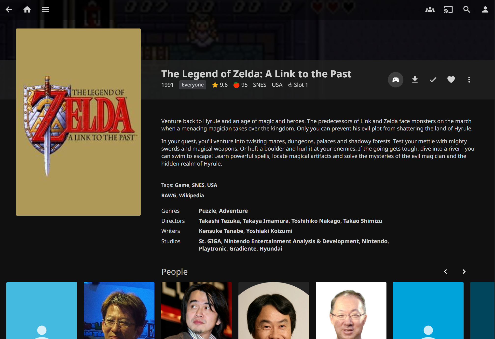
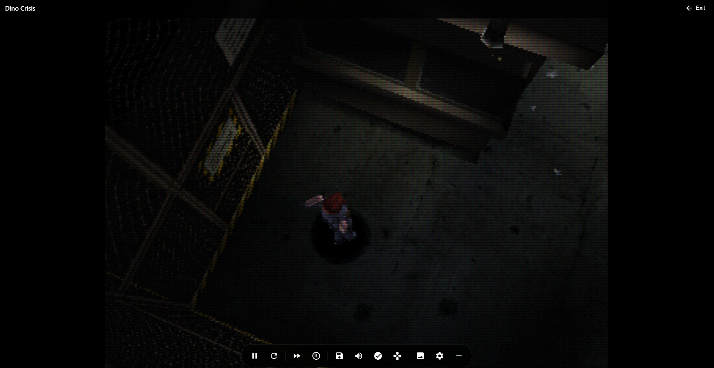
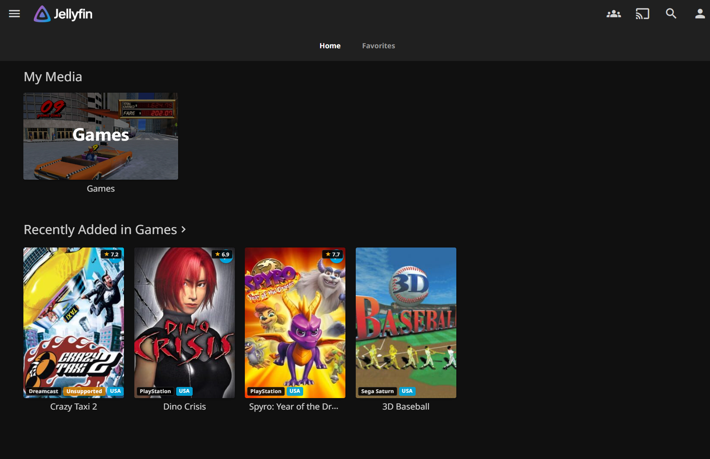
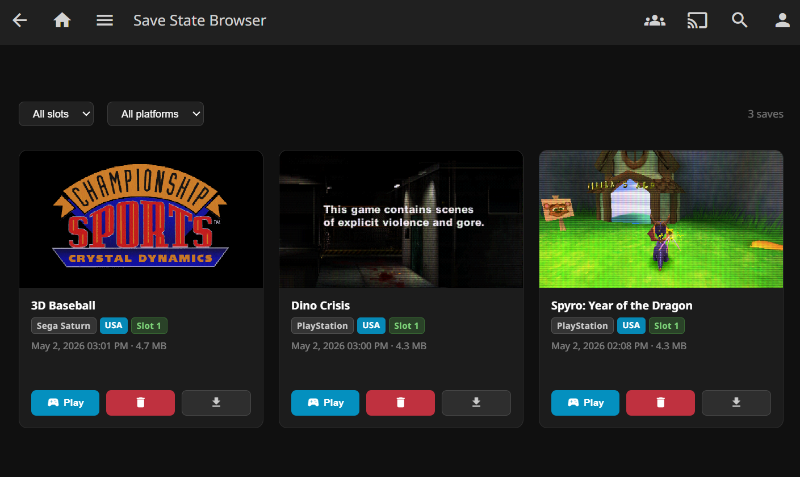
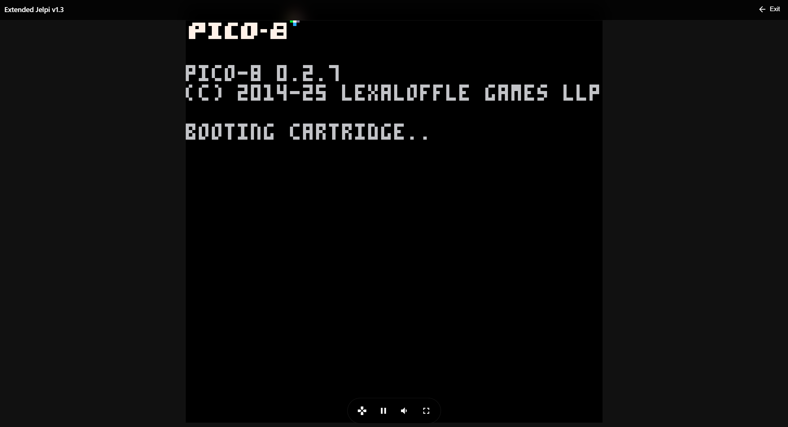
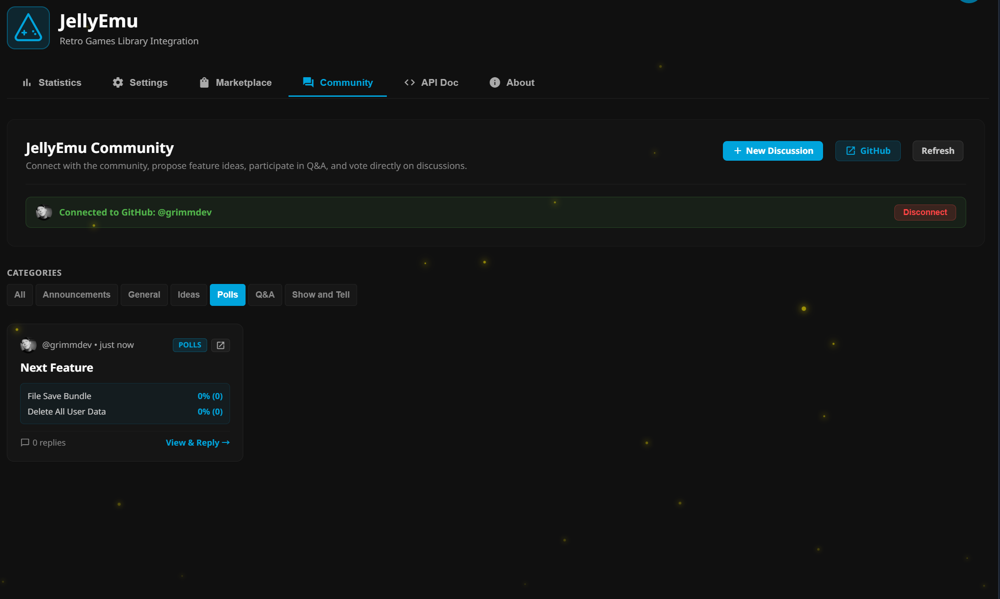

<div align="center">
  
  <h1>JellyEmu</h1>
  <p>A plugin for jellyfin (10.11.x - 12) to import, manage, play and share your roms and pico-8 games with users.</p>
  <p><sub>Now with Romm integration, pico-8, VR/AR, <a href="https://github.com/Jellyfin-PG/JellyEmu-HomeAssistant-Plugin">HomeAssistant</a>, RetroArch, NetPlay, and <a href="https://github.com/Jellyfin-PG/JellyEmu-Playnite">Playnite</a> support.</sub></p>
</div>

<p align="center">
  <a href="https://github.com/Jellyfin-PG/JellyEmu/actions">
    
  </a>

  <a href="https://github.com/Jellyfin-PG/JellyEmu/releases">
    
  </a>

  <a href="https://github.com/orgs/Jellyfin-PG/projects/2">
    
  </a>

  <a href="https://github.com/Jellyfin-PG/JellyEmu/actions/workflows/ci.yml">
    
  </a>
  
  <a href="https://github.com/Jellyfin-PG/JellyEmu/actions/workflows/codeql.yml">
    
  </a>

  <a href="https://discord.gg/v7P9CAvCKZ">
    
  </a>
</p>

---

## Screenshots

<p align="center">
  <a href="assets/screen01.png">
    
  </a>
   
  <a href="assets/screen02.png">
    
  </a>

  <a href="assets/screen03.png">
    
  </a>

  <a href="assets/screen04.png">
    
  </a>
  
  <a href="assets/screen05.png">
    
  </a>

  <a href="assets/screen06.png">
    
  </a>
</p>
<p align="center">
  <em>Click on an image to view it full size.</em>
</p>

---

<div align="center">

<h2>Documentation</h2>

<table>
<tr>
<td align="center" width="25%">

<a href="https://github.com/Jellyfin-PG/JellyEmu/wiki/Installation">
<b>Installation</b>
</a>

<br>
Install JellyEmu and its dependencies

</td>

<td align="center" width="25%">

<a href="https://github.com/Jellyfin-PG/JellyEmu/wiki/Plugin-Setup">
<b>Plugin Setup</b>
</a>

<br>
Setup JellyEmu and Library

</td>

<td align="center" width="25%">

<a href="https://github.com/Jellyfin-PG/JellyEmu/wiki/RetroArch">
<b>RetroArch</b>
</a>

<br>
Configure RetroArch emulation
</td>

<td align="center" width="25%">

<a href="https://github.com/Jellyfin-PG/JellyEmu/wiki">
<b>Wiki</b>
</a>

<br>
View all documentation

</td>
</tr>
</table>
</div>

## ROM Naming & Folder Structure Guide

JellyEmu uses a smart detection system to figure out which console a ROM belongs to and exactly which game it is. You have a lot of flexibility in how you organize your library.

### How Platform Detection Works
The plugin determines a ROM's platform using a strict 3-step priority list. If step 1 fails, it moves to step 2, and so on.

1. **Inline Tokens:** The system looks for a platform name wrapped in brackets `[]` or parentheses `()` anywhere in the filename.
2. **Folder Names:** The system checks the parent and grandparent folder names of the ROM file.
3. **File Extensions:** The system checks the file extension. This only works for **unambiguous** extensions (like `.nes` or `.z64`).

> **Note on Ambiguous Formats:** Formats shared across multiple consoles (like `.iso`, `.chd`, `.cue`, and `.pbp`) are considered ambiguous. For these files, you **must** use an inline token or place them in a properly named folder, otherwise the platform will be marked as "Unknown".

### Method 1: Organizing by Folder (Recommended)
The easiest way to organize a large library is to place your ROMs inside folders named after the console. JellyEmu checks up to two directories up, so subfolders for game series are perfectly fine.

The folder name can be the official name or a common abbreviation (e.g., `SNES`, `Super Nintendo`, and `Super Famicom` will all map to **SNES**).

**Examples:**
```text
/ROMs/
 ├── /SNES/
 │    └── Super Mario World.sfc          (Platform: SNES)
 ├── /PlayStation/
 │    ├── /Final Fantasy VII/
 │    │    └── Disc 1.chd                (Platform: PlayStation)
 └── /Sega Genesis/
      └── Sonic The Hedgehog.md          (Platform: Sega Genesis)
```

### Method 2: Inline Naming Tokens
If you prefer to dump all your ROMs into a single flat directory, you can explicitly define the platform by adding the console name in brackets `[]` or parentheses `()` in the filename.

JellyEmu will automatically hide these platform tags in the user interface so your game titles remain clean.

**Examples:**
* `Sonic CD [Sega CD].chd` ➔ UI Display: **Sonic CD**
* `Crash Bandicoot (PS1).chd` ➔ UI Display: **Crash Bandicoot**
* `Super Mario 64 [Nintendo 64].z64` ➔ UI Display: **Super Mario 64**

*region flags are now parsed (like `(USA)`) and added to game details.*

*revision flags (like `[!]`) are intentionally ignored by the platform detector and will remain part of the display name.*

### Method 3: Multi-Disc Playlists (`.j3u`)
For retro games that span across multiple discs (like PlayStation or Dreamcast games), you can create a custom playlist file with the `.j3u` extension (JellyEmu's specialized format for multi-disc games).

This enables seamless gameplay and disc switching using the "One Smooth Move" workflow:
1. When playing a `.j3u` playlist, JellyEmu automatically adds **Next Disc** and **Select Disc** controls to the player dock.
2. Swapping discs auto-saves your game progress to a temporary slot (Slot 99), updates the user's active disc preference, reloads the interface, and automatically restores the save state so you can carry over progress seamlessly.

**How to configure a `.j3u` playlist:**
1. Place your ROM files (e.g., `.chd`, `.bin`, `.iso`) in the same directory.
2. Create a plain text file named after the game with a `.j3u` extension (e.g., `Final Fantasy VII (USA).j3u`).
3. Open the file in a text editor and list the relative paths to each disc's ROM file, one per line:
   ```text
   Final Fantasy VII (USA) (Disc 1).chd
   Final Fantasy VII (USA) (Disc 2).chd
   Final Fantasy VII (USA) (Disc 3).chd
   ```
4. Place the `.j3u` file in your library alongside your ROM files.

---

### Forcing Specific Metadata (IGDB & RAWG)
Sometimes, game titles are ambiguous, or a metadata provider grabs the wrong version of a game (like an HD remake instead of the retro original). 

You can force JellyEmu to link the ROM to a specific database entry by adding a provider ID directly into the filename. The plugin will use this exact ID to fetch artwork and descriptions, and will automatically hide the token from the UI.

| Provider | Tag |
| :--- | :--- |
| **RAWG** | [rawg-19291] |
| **IGDB** | [igdb-9102] |
| **Wikipedia** | [wiki-8482] |
| **LexalOffle** | [loid-819821] |
| **Hasheous** | [hash-235694] |
| **SteamDBGrid** | [sdbg-34084] |

**Examples:**
* `Doom [igdb-1039].iso` ➔ Forces the IGDB entry for the 1993 original, rather than the 2016 reboot.
* `Aladdin (Sega) [rawg-871812].md` ➔ Forces the exact RAWG entry.

You can combine provider IDs and platform tokens safely. For example:
`Sonic Adventure [igdb-3273][Sega CD].chd` will properly match the IGDB database entry, assign it to the Sega CD platform, and display cleanly as simply **Sonic Adventure**.
